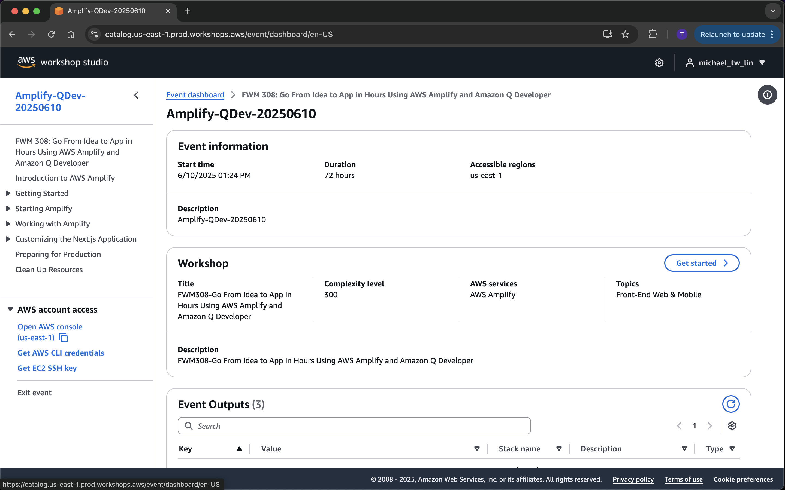
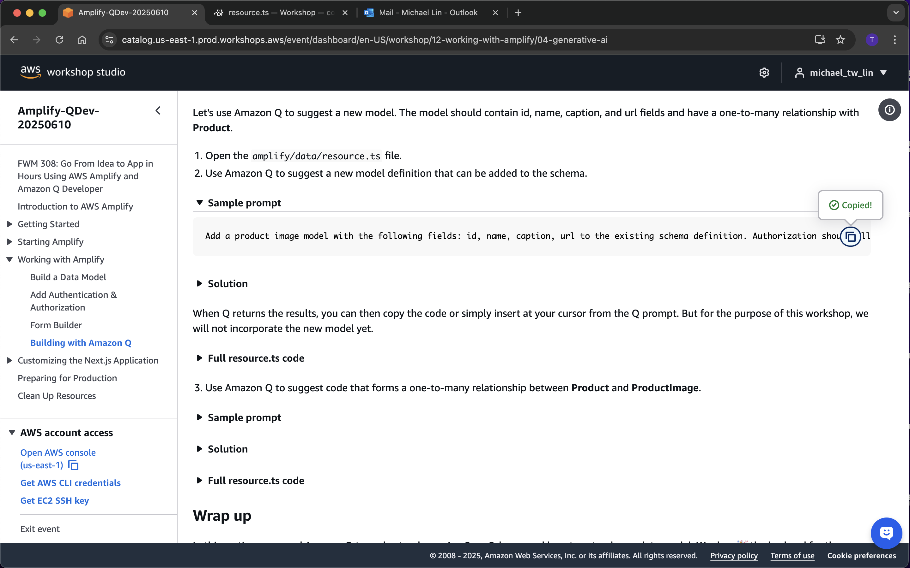
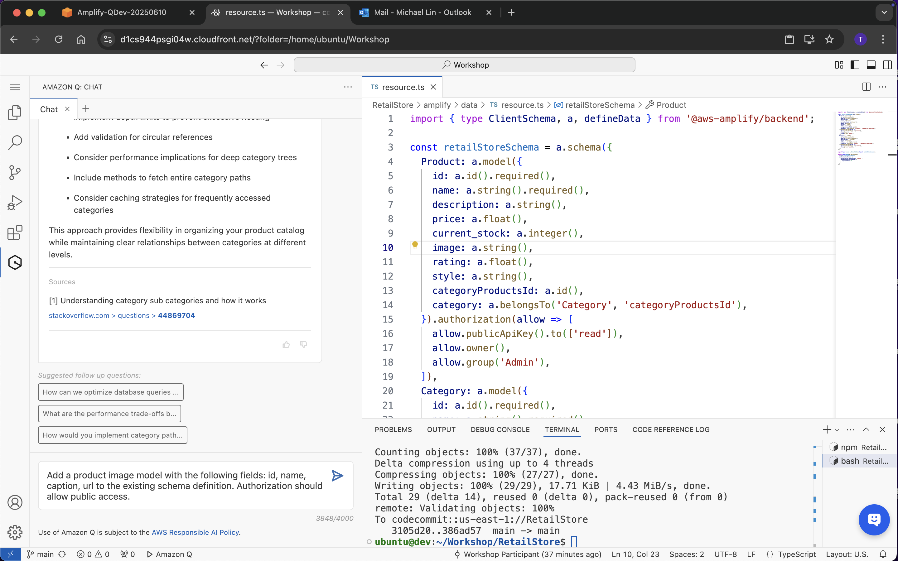
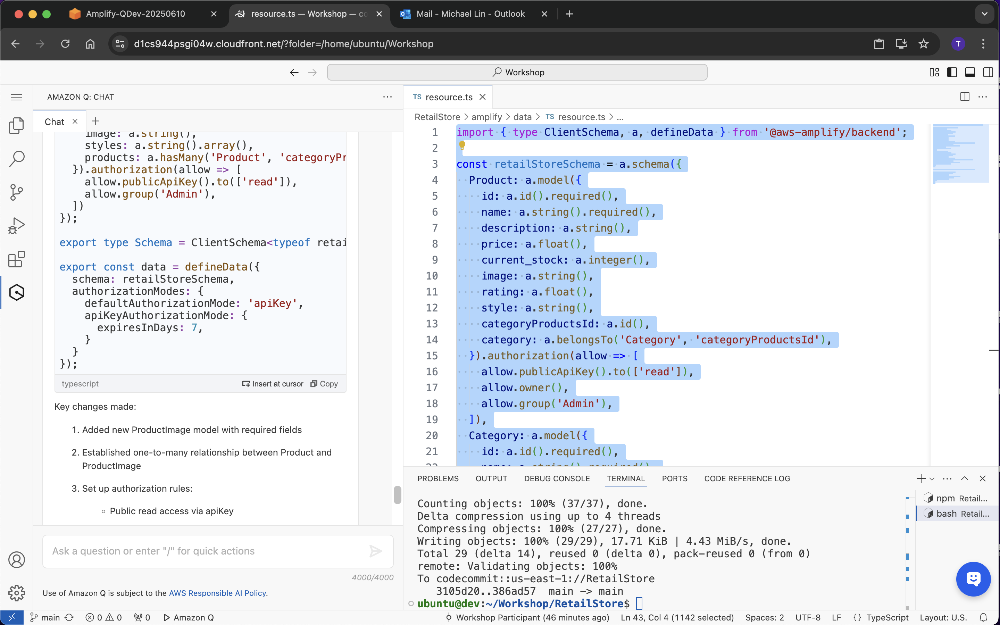
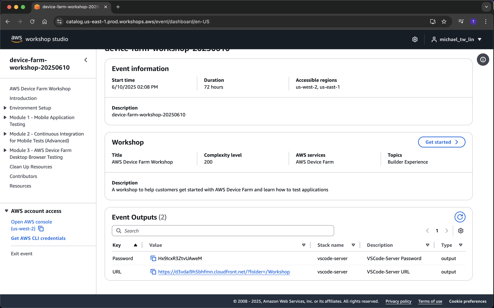
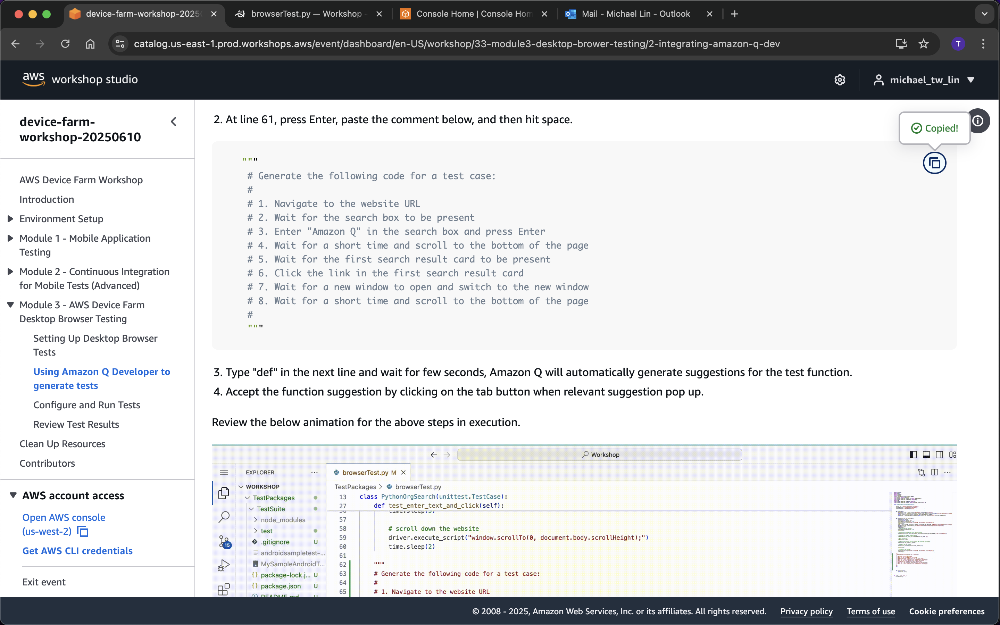
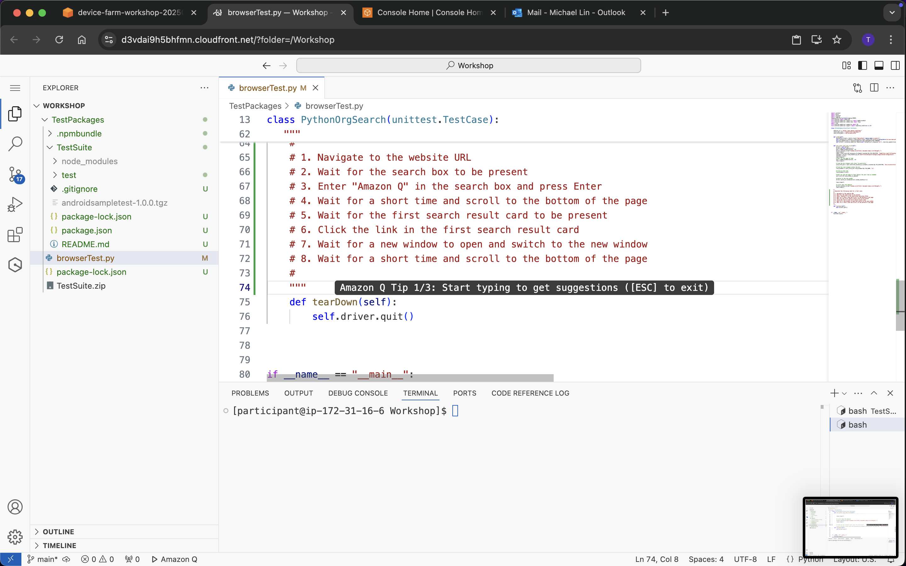
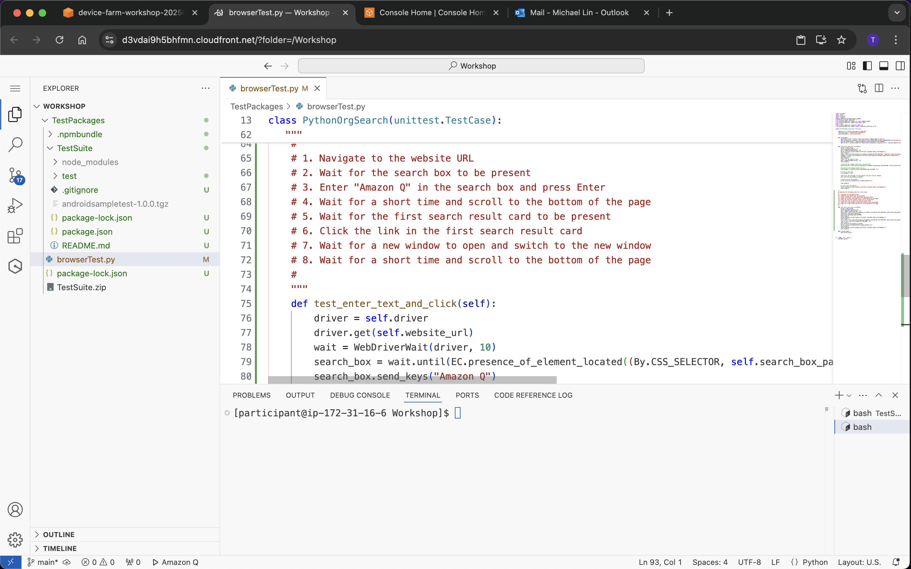

Week 5
 

What I did

- I completed skill checks for the week by stepping through a Workshop on AWS Amplify, leveraging Q Developer for some of the code suggestions. https://shorturl.at/DJ4c3
- I also got hands-on with another workshop focused on  AWS Device Farm, with opportunity to experiment with Web browser testing. https://shorturl.at/RuKcs

 

What I learned
- I learned that AWS Amplify is a full-stack platform that simplifies app development with ready-made components for hosting, APIs, authentication, and data storage. Gen 1 uses CLI-guided workflows with hidden infrastructure, while Gen 2 offers a code-first TypeScript approach with customizable CDK infrastructure.
- I learned that AWS Device Farm enables testing mobile apps on hundreds of real Android and iOS devices in the cloud without buying hardware. It captures failure videos/screenshots, integrates with testing frameworks like Appium, and connects with CI/CD pipelines for automated testing.

 
 
Appendix 1. Screenshots from AWS Ampilfy Workshop (with Q Dev in Action)

 
 
Appendix 2. Screenshots from AWS Device Farm Workshop (with Q Dev in Action)

 
